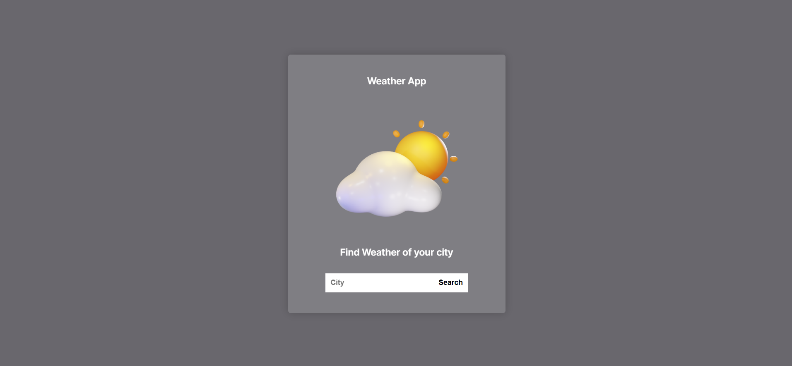
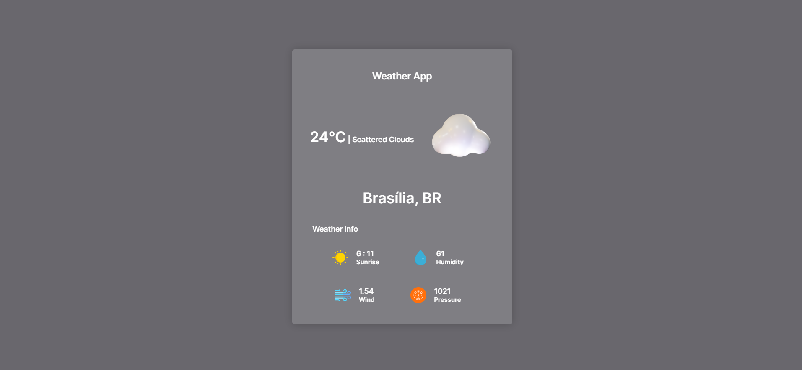

# Weather App

Aplicação em React.Js que mostra as informações do clima em tempo real da cidade pesquisada, consumindo a [Weather API](https://openweathermap.org/api).

## Como rodar passo a passo:

1. Clone o projeto com `git clone https://github.com/prince-neres/weather-app.git`
2. Entre no diretório do projeto com `cd weather-app`
3. `npm i` ou `yarn`
4. `npm start` ou `yarn start`

## Preview:

<h3 align="center">Pesquisa de cidade</h3>

  

<h3 align="center">Clima da cidade</h3>

  

## Tecnologias utilizadas:

- [React.js](https://pt-br.reactjs.org/)
- [Styled Components](https://styled-components.com/)
